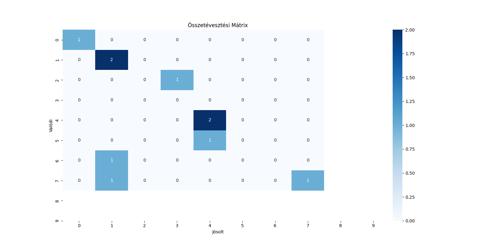

# MachineLearning

neurális hálózat, képfelismerés megadott számú traning adat amely feldolgozása után kimenetként kapunk egy százalékos eredmény a képfelismerés mértékéről.
minnél nagyobb a training data és a tesztadat annál jobb kimenetel
veszteség --loss aránya magasabb kevesebb kép feldolgozásánál

cpu felhasználás -- erőforrás igényes

kimenet 

train kép száma: 100
teszt kép száma: 10
[1/5] Veszteség: 2.3255
[2/5] Veszteség: 2.2255
[3/5] Veszteség: 2.1347
[4/5] Veszteség: 1.9780
[5/5] Veszteség: 1.8653
Tanítás befejezve!

Modell pontossága: 60.00%

valódi és becsült érték ábrán való megjelenítése 

